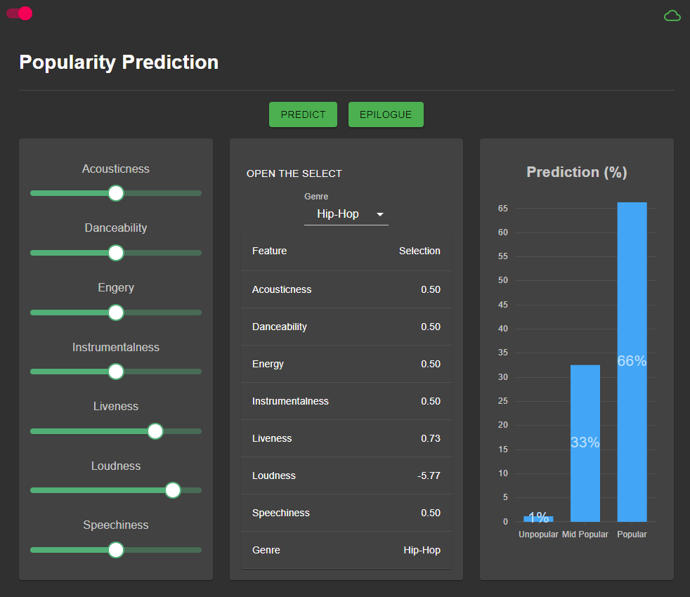

## Spotify-ML-Front

---

### This repo is frontend part of spotify-ml repo.

### The backend part is in https://github.com/moz5691/spotify-ml

### To run it in local

    // create ".env" file in root level
    REACT_APP_BASE_URL=<API URL>

### To run it in cloud

    Add key/value pair in process.env
    key: REACT_APP_BASE_URL value: <API URL>

### To start

    npm start

